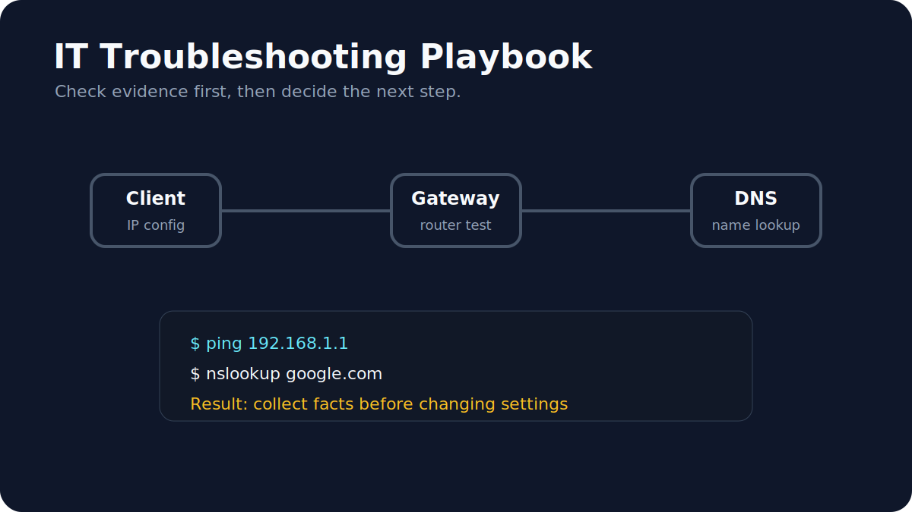

# IT Troubleshooting Playbook



A practical troubleshooting playbook for common IT support situations.

The goal is simple: when something does not work, do not guess first. Check the basics, collect evidence, then decide the next step.

## Playbooks

- [Internet funktioniert nicht](internet-not-working.md)
- [DNS, DHCP and Gateway Basics](dns-dhcp-gateway.md)
- [Terminal Command Notes](terminal-command-notes.md)
- [Was ist DNS?](was-ist-dns.md)

## Focus

This repository starts with network troubleshooting because it is one of the most common support situations:

- internet connection problems
- wrong or missing IP configuration
- DNS problems
- DHCP problems
- gateway/router problems
- basic terminal checks

## Short German Explanations

| Begriff | Kurze Erklärung |
|---|---|
| IP-Adresse | Eine Adresse, mit der ein Gerät im Netzwerk erreichbar ist. |
| DNS | Übersetzt Domainnamen wie `google.com` in IP-Adressen. |
| DHCP | Verteilt automatisch IP-Adressen und Netzwerkeinstellungen. |
| Gateway | Der Router, über den ein Gerät andere Netzwerke erreicht. |
| Ping | Testet, ob ein Ziel erreichbar ist und wie lange die Antwort dauert. |

## What This Repository Shows

- I can structure a technical problem step by step.
- I know the basic difference between IP, DNS, DHCP and gateway.
- I can use terminal commands to collect information.
- I document technical topics in a simple and readable way.
- I am building this repository as practical proof for IT system and support fundamentals.

## Interview Practice Sentences

```txt
Ich prüfe zuerst, ob das Gerät eine gültige IP-Adresse hat.
Danach teste ich das Gateway und die DNS-Auflösung.
Ich ändere nicht sofort Einstellungen, sondern sammle zuerst Informationen.
```

## Example Command Outputs

```bash
ping -c 3 192.168.1.1
```

```text
64 bytes from 192.168.1.1: icmp_seq=0 ttl=64 time=3.2 ms
64 bytes from 192.168.1.1: icmp_seq=1 ttl=64 time=2.8 ms
64 bytes from 192.168.1.1: icmp_seq=2 ttl=64 time=3.0 ms
```

```bash
nslookup google.com
```

```text
Server:  192.168.1.1
Address: 192.168.1.1#53

Non-authoritative answer:
Name: google.com
Address: 142.250.185.14
```

## Next Improvements

- Add screenshots or example command outputs
- Add a printable checklist
- Add a German-only version for interview practice
- Add more scenarios: slow PC, full storage, printer problem, software installation issue
